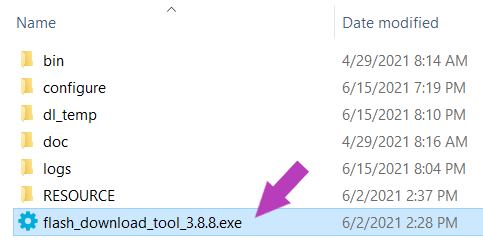

# gavesha-releases

ඔබේ ESP32 පරිපථය සඳහා ගැලපෙන ගවේෂ Bluetooth ප්‍රෝග්‍රෑමය මෙතැනින් බාගත කරන්න පුළුවන්. 

## ගවේෂ ගැන හැඳින් වීමක්
ගවේෂ කියන්නේ ඉලෙක්ට්‍රොනික විද්‍යාව, පරිගණක තාක්ෂණය වැනි නවීණ තාක්ෂණයන්ට ඇලුම් කරන ඔබ වැනි නව නිපැයුම්කරුවන් වෙනුවෙන් සෑදුණු විනෝදාත්මක අධ්‍යාපනික ඇප් එකක්. ඉගෙන ගන්නවාට අමතරව ස්මාර්ට් ෆෝන් එක හරහා Python පරිගණක භාෂාවෙන් ESP32 අඩංගු ESP32 Devkit, Magic:bit වැනි පරිපථ Bluetooth හරහා ප්‍රෝග්‍රෑම් කරන්න හැකියාවත් මේ ඇප් එකේ තියෙනවා. මේ නිසා පරිගණකයක් නැතුව ඕනෙම තැනක සිට code ලියන්න, අත්හදා බලන්න, විවිධ නිර්මාණ කරන්න හැකියාව ඔබට ලැබෙනවා.    

ගවේෂ ඇප් එක ESP32 පරිපථයට සම්බන්ධ කරන්න නම් මේ Git repository එකේ තියෙන ESP32 වල Bluetooth සක්‍රියකරවන ප්‍රෝග්‍රෑමය එහි ස්ථාපිත (flash) කරන්න ඕන. ඒ සඳහා අනුගමනය කරන්න ඕන පියවර මේ ලිපි ගොනුවේ අඩංගුයි.

ගවේෂ ගැන වැඩි විස්තර අලුත් නිවේදන දැනගන්න අපගේ [Facebook]( https://www.facebook.com/Gavesha-Education-Platform-ගවේෂ-100266208438550/) පිටුව හා එක්වන්න.

### විශේෂ දැනුම් දීමක්

**ගවේෂ ඇප් එක දැන් බීටා ටෙස්ටින් සඳහා මුදා හැරලා තිබෙනවා. ගවේෂ අත්හදා බලන්න කැමති අය පහත තියෙන පෝරමය පුරවා ලියාපදිංචි වෙන්න**

**[බීටා ටෙස්ට් ලියාපදිංචි පෝරමය](https://forms.gle/iUNX7qfbFhVGu1kT8)** 

## ESP32 පරිපථයට ගවේෂ Bluetooth ප්‍රෝග්‍රෑමය ස්ථාපිත කරන අයුරු

1. මුලින්ම මේ පිටුවේ තියෙන Bluetooth ප්‍රෝග්‍රෑමය රූපයේ පෙන්වා ඇති පරිදි බාගත කර ගන්න. එසේ බාගත කරගත් gavesha-releases-main.zip ෆයිල් එක සුදුසු තැනකට unzip කර ගන්න.

    

2. ESP32 පරිපථයට මේ ප්‍රෝග්‍රෑමය ස්ථාපිත කරන්න නම් **Flash Download Tool** කියන පරිගණක වැඩසටන අවශ්‍යය වෙනවාවෙනවා. එය [espressif.com](https://www.espressif.com/en/support/download/other-tools) පිටුවෙන් රූපයේ පෙන්වා ඇති ආකාරයට බාගත කර ගන්න.

    

3.  මෙසේ බාගත වෙන zip ෆයිල් එකත් සුදුසු තැනකට unzip කර ගන්න. ඉන්පසු එහි තියෙන Flash Download Tool එක විවෘත කර ගන්න. 

    

4. විවෘත වෙන කුඩා වින්ඩෝවේදී පහත දැක්වෙන අයුරින් සැකසුම් සාදා ගෙන OK බොත්තම ඔබන්න.

   

5. දැන් ඔබේ ESP32 පරිපථය USB වයරයකින් පරිගණකයට සම්බන්ධ කර ගන්න. Windows Device Manger වෙත ගොස් ඔබේ ESP32 පරිපථයේ COM Port අංකය බලා ගන්න.

     

6. Flash Download Tool වැඩසටහනේ පහත දැක්වෙන අයුරින් සැකසුම් කර ගන්න.

   A.	කුඩාවට ඇති `[…]` බොත්තම ඔබා බාගත කරගත් **gavesha-on-esp32.bin** ෆයිල් එක තෝරා ගන්න.

   B.	**@** සලකුණ දකුණු පස ඇති කොටුවේ **0x1000** අගය ලියන්න.

   C.	ඉදිරියෙන් ඇති **Checkbox** එක සක්‍රිය කරන්න.

   D.	**COM:** ලැයිස්තුවෙන් ගැලපෙන  COM port අංකය තෝරා ගන්න. Baud rate එක ලෙස 230400 තෝරා ගන්න.

    

7. **START** බොත්තම ඔබන්න.

8. ප්‍රෝග්‍රෑම්ය ESP32 පරිපථයට බාගත වෙනවා ඔබට පේනවා ඇති. එය සම්පූර්ණ වූ විගස කොල පාට කොටුවේ **FINISH** ලෙස සඳහන් වෙනවා. මෙතැන් පටන් ඔබේ ESP32 පරිපථය ගවේෂ ඇප් එකට සම්බන්ධ කරන්න පුළුවන්.

   
